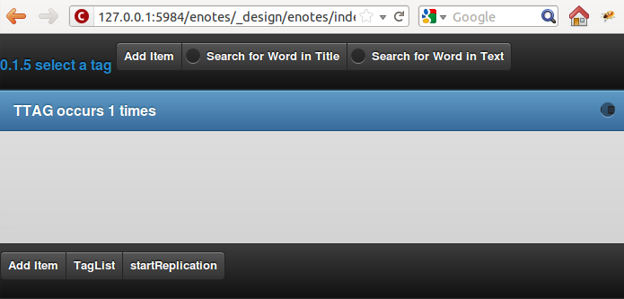

Program Logic
=============

We just have provided enought code to define a simple interface which does not do anything but display static words right now. To change this, we need to enter some JavaScript code.

Overview
--------

To give you an overview of the inner workings of our CouchApp and as a reference, you may refer to the following diagram. Dotted lines represent function calls and normal ones folder relations. Only folders relevant for us are represented, so if you miss e.g. the folders ``lists``, ``shows``, ``updates`` or ``vendor`` don't wonder.

.. graphviz::

    digraph {
        graph [size="12,9"]
        graph [ranksep=0.00]
        graph [nodesep=0.00]
        // graph [ratio=4]
        graph [rankdir=TB]
        // graph [orientation=landscape]
        graph [ratio=auto]
        graph [labelloc=t]
        
        node [fontname=Verdana,fontsize=10]
        node [style=filled]
        node [fillcolor="#EEEEEE"]
        node [color="#EEEEEE"]
        edge [color="#555555"]
        edge [fontsize=8]
        edge [arrowsize=0.5]
        edge [fontcolor=grey]
        
        "enotes" [shape=box]
        
        "_attachments" [color="grey"]
        "evently" [color="grey"]
        "addPage" [color="grey"]
        "_init" [color="grey"]
        "selectors" [color="grey"]
        "input" [color="grey"]
        "editContent" [color="grey"]
        "shownote " [color="grey"]
        "_init " [color="grey"]
        "selectors " [color="grey"]
        "a[op=delete]" [color="grey"]
        "a[op=save]" [color="grey"]
        "editPage" [color="grey"]
        "tagListPage" [color="grey"]
        " selectors" [color="grey"]
        " a " [color="grey"]
        "tagListContent" [color="grey"]
        "_init  " [color="grey"]
        " selectors " [color="grey"]
        "  a " [color="grey"]
        "titleListPage" [color="grey"]
        "titleListContent" [color="grey"]
        "updateTitleList" [color="grey"]
        "  selectors  " [color="grey"]
        "  a  " [color="grey"]
        "views" [color="grey"]
        "DocbyTag" [color="grey"]
        "DocbyTag2" [color="grey"]
        
		"enotes" -> "_attachments"
			"_attachments" -> "index.html"
			"_attachments" -> "logic.js"
			
		"enotes" -> "evently"
			"evently" -> "addPage"
				"addPage" -> "pagebeforeshow.js"
				"addPage" -> "_init"
					"_init" -> "selectors"
						"selectors" -> "input"
							"input" -> "click.js"

			"evently" -> "editContent"
				"editContent" -> "shownote "
					"shownote " -> "data.js"
					"shownote " -> "async.js"	
					"shownote " -> "mustache.html"
					"shownote " -> "after.js"
				"editContent" -> "_init "
					"_init " -> "selectors "
						"selectors " -> "a[op=delete]"
							"a[op=delete]" -> " click.js"
						"selectors " -> "a[op=save]"
							"a[op=save]" -> "  click.js"
			
			"evently" -> "editPage"
				"editPage" -> " pagebeforeshow.js"
			
			"evently" -> "tagListPage"
				"tagListPage" -> "  pagebeforeshow.js"
				"tagListPage" -> " selectors"
					" selectors" -> " a "
						" a " -> " click .js"
			
			"evently" -> "tagListContent"
				"tagListContent" -> "_init  "
					"_init  " -> " mustache.html"
					"_init  " -> " after.js"
					"_init  " -> " data.js"
					"_init  " -> " query.json"
					"_init  " -> " selectors "
						" selectors " -> "  a "
							"  a " -> " click.js "
			
			"evently" -> "titleListPage"
				"titleListPage" -> " pagebeforeshow.js "
						
			"evently" -> "titleListContent"
				"titleListContent" -> "updateTitleList"
					"updateTitleList" -> "  data.js  "
					"updateTitleList" -> "  async.js  "
					"updateTitleList" -> "  mustache.html  "
					"updateTitleList" -> "  after.js  "
					"updateTitleList" -> "  selectors  "
						"  selectors  " -> "  a  "
							"  a  " -> "  click.js  "

		"enotes" -> "views"
			"views" -> "DocbyTag"
				"DocbyTag" -> "map.js"
				"DocbyTag" -> "reduce.js"
			"views" -> "DocbyTag2"
				"DocbyTag2" -> "map.js "

		
		
		"index.html" -> "logic.js" [color=grey, label="loads", constraint=false]
		// "index.html" -> { "addPage"; "editContent"; "editPage"; "tagListPage"; "tagListContent"; "titleListPage"; "titleListContent"} [color=grey, label="links", concentrate=true]
		"pagebeforeshow.js" -> "shownote " [color=grey, label="triggers"]
		"click.js" -> "shownote " [color=grey, label="triggers"]
		"click.js" -> "logic.js" [color=grey, label="doStoreDocument()"]
		" pagebeforeshow.js " -> "updateTitleList" [color=grey, label="triggers"]
		"  async.js  " -> "logic.js" [color=grey, label="doGetDoc()"]
		"  async.js  " -> "logic.js" [color=grey, label="makeEmptyNote()"]
		"  pagebeforeshow.js" -> "_init  " [color=grey, label="triggers"]
		// " click.js " -> nur für REPLICATION
		"  async.js  " -> "logic.js" [color=grey, label="doView()"]
		" pagebeforeshow.js" -> "shownote " [color=grey, label="triggers"]
		"shownote " -> "logic.js" [color=grey, label="doGetDoc()"]
		" click.js" -> "logic.js" [color=grey, label="doDeleteDocument()"]
		"  click.js" -> "logic.js" [color=grey, label="doStoreDocument()"]
		"  click.js" -> "shownote " [color=grey, label="triggers"]
		
	}


StartUp Code
------------

First, we need some code that initializes our application. We stay at our HTML file and add the following lines to the end of the file (but still within the ``<html>``)

.. code-block:: html

        ...
        ...
        </body>
        <script src="vendor/couchapp/loader.js"></script>
        <script src="logic.js"></script>
    </html>
    
This code will execute two java scripts after loading the HTML page. One stored at ``vendor/couchapp/loader.js`` and the other one just called ``logic.js``. Since we refer to these files, we will create them now.

loader.js
_________

This file is located inside the ``vendor`` directory of our CouchApp tree. So, let's navigate to this folder and enter the subfolder called ``couchapp``. Here you see an additional directory called ``_attachments``. This one holds all files which are attached to the design document of our CouchApp under the context of "vendor". Its exactly the same as the default "_attachments" directory at our base with the difference that these files are uploaded within the "vendors" field.
We create the empty file ``loader.js`` at this location and open it with a text editor.

Enter the following function to the file:

.. code-block:: js

    function couchapp_load(scripts) {
        for (var i=0; i < scripts.length; i++) {
            document.write('<script src="'+scripts[i]+'"><\/script>')
        };
    };

This function takes an array as argument (``scripts``) which holds a list of libraries. These libraries then are formatted to represent HTML calls and are injected into the HTML from where this function was called (in your case, into ``index.html``). Thereby, these JavaScript libraries are loaded themselves.

But for the function to do anything it must not only be defined, but also be called. So, let's call it. After the function definition, insert:

.. code-block:: js

    ...
    ...
    couchapp_load([
        "/_utils/script/sha1.js",
        "/_utils/script/json2.js",
        "/_utils/script/jquery.js",
        
        "vendor/couchapp/jquery-1.6.2.min.js",
        
        "/_utils/script/jquery.couch.js",
        "vendor/couchapp/jquery.couch.app.js",
        "vendor/couchapp/jquery.couch.app.util.js",
        
        "vendor/couchapp/jquery.pathbinder.js",
        "vendor/couchapp/jquery.mustache.js",
        "vendor/couchapp/jquery.evently.js",
        
        "vendor/couchapp/jquery-ui-1.8.11.custom.min.js",
        "vendor/couchapp/jquery.mobile-1.0.min.js"
    ]);


This last code consists of the function call ``couchapp_load`` and an array of libraries to be loaded. So, when the file ``loader.js`` is opened from our HTML file, exactly this happens. The order in which these libraries are loaded is important since some of them depend on each other and cannot be loaded properly if the files they depend on have not already been loaded.

Let's review these libraries and copy the ones still missing to ``vendor/couchapp/_attachments/``:

..
    * The ones stored in ``/_utils/`` refer to files already available within CouchDB. Remember, the path ``/_utils/`` points to the CouchDB user interface when used within a web browser.

    * The file ``"vendor/couchapp/_attachments/jquery.couch.js"`` comes with every CouchDB installation and offers a JavaScript interface for the CouchApp. To be able to load this library, you have to find it and copy it to its place in the CouchApp directory tree (in an Unbunu Linux installation you will find the file at ``/usr/local/share/couchdb/www/script/jquery.couch.js``).

    * The same goes with ``jquery-ui-1.8.11.custom.min.js``. It is located at ``/usr/local/share/couchdb/www/script/jquery-ui-1.8.11.custom.min.js``. The name of this file can vary slightly with your version of CouchDB (e.g. the version number). Also copy this file to ``vendor/couchapp/_attachments/jquery-ui-1.8.11.custom.min.js``. If your name is different than the one used in this document, you have to change the according entry in ``vendor/couchapp/_attachments/loader.js``.

    * ``jquery-1.6.2.min.js`` is the actual jQuery library. :download:`You can find it here. </_downloads/jquery-1.6.2.min.js>` Save it to ``vendor/couchapp/_attachments/jquery-1.6.2.min.js``.

    * For the mobile version of jQuery, we use the file ``jquery.mobile-1.0.min.js``. :download:`It is available here. </_downloads/jquery.mobile-1.0.min.js>`. This file has to be placed at ``vendor/couchapp/_attachments/jquery.mobile-1.0.min.js`` also.

    * We need the file ``jquery.pathbinder.js`` to be able to use evently functions stored in the CouchApp directory tree. :download:`YOU CAN DOWNLOAD THIS FILE HERE </_downloads/jquery.pathbinder.js>`. Please save it at ``vendor/couchapp/_attachments/jquery.pathbinder.js``.

    * The file ``jquery.evently.js`` is also necessary. :download:`PLEASE DOWNLOAD IT HERE </_downloads/jquery.evently.js>` and put it to ``vendor/couchapp/_attachments/jquery.evently.js``.

    * All the other files are already present.


============================ ================================================================= ===============================
file                         explanation                                                       where to get
============================ ================================================================= ===============================
``/_utils/*.*``              They refer to files already available within CouchDB. Remember,   already present
                             the path ``/_utils/`` points to the CouchDB user interface when 
                             used within a web browser.
                             interface for the CouchApp.                                       
``jquery-ui*.min.js``        The actual name of this file depends on the version you have      already present, if not find it with a file 
                             dowloaded in the previous chapter. Remember to change the entry   search tool on your system
                             in ``loader.js`` accordingly!
``jquery-1.6.2.min.js``      This is the actual jQuery library.                                :download:`Download a working copy here </_downloads/jquery-1.6.2.min.js>` 
                                                                                               or go to
                                                                                               http://docs.jquery.com/Downloading_jQuery
``jquery.mobile-1.0.min.js`` The mobile version of jQuery. A newer version than the one        Already present, if not: :download:`Download here 
                             proposed here may also work for you. We already downloaded this   </_downloads/jquery.mobile-1.0.min.js>` or find it at
                             file in the previous chapter.                                     http://jquerymobile.com/download/
``jquery.pathbinder.js``     We need this file to use evently functions stored in the CouchApp :download:`Download here </_downloads/jquery.pathbinder.js>`
                             directory tree.
``jquery.evently.js``        Evently bindings                                                  :download:`Download here </_downloads/jquery.evently.js>`
other files                  All other files are already present.
============================ ================================================================= ===============================


If we export our CouchApp to our CouchDB again (``enotes$ couchapp push enotes``) and open the exported CouchApp (``http://localhost:5984/enotes/_design/enotes/index.html``), we will see that the appearance of the ``index.html`` has changed.

    .. image:: images/4_jQuery.png
    
This change has happened solely because of the reference to the additional JavaScript libraries. The reason the graphics have been added is due to jQuery. In our ``index.html`` we have already set certain attributes that tell jQuery how to design the elements (like for example hyperlinks as buttons).

If you click on the button in the lower right labeled "Add Item", our "Add Item" subpage is shown. This happens, because the hyperlink behind this button links to ``#addPage``. jQuery interpretes this link and loads the subpage with the id "addPage".

logic.js
________

Finally, the file ``logic.js`` handles the program logic unique to our application. Here the functions are defined or linked to, that are executed when a certain event is triggered in our HTML file.

Since it does not exist yet, we have to create it. It should be located at ``/_attachments/logic.js``. Now, lets fill in some code!

.. code-block:: js

    $dbname = "enotes";
    $appname= "enotes";
    $db = $.couch.db($dbname);
    
    $("body").data =    { "tagSelected" : "NOTAG"
                    , "idSelected" : 0
                    , "docEdited" : ""
                    , "tagsUsed"  : []
                    , "textSearchString" : false
                    , "titleSearchString" : false
                    , "tagSelected" : false
                    };

This first part creates the variables ``$dbname``, ``$appname`` and ``$db``. As you may have guessed, the first two entries denote the name of the database we are using and the second one states the name of our CouchApp. The third variable defines our database connection. ``$.couch.db($dbname)`` is a method that is located within the file ``/vendor/couchapp/_attachments/jquery.couch.js``.
The command ``$("body").data`` is a jQuery specific method. It attaches any information in JSON format to a given DOM element. In our case it is the ``body`` element this information is attached to. This defines the initial state our CouchApp is in when it is started.

We will go on by adding the following lines to the same file:

.. code-block:: js
                    
	$.couch.app(function (app) {
		$("#addContent").evently("editContent", app);
		$("#addPage").evently("addPage", app);
		$("#tagListPage").evently("tagListPage", app);
		$("#tagListContent").evently("tagListContent", app);
		$("#titleListPage").evently("titleListPage", app);  
		$("#titleListContent").evently("titleListContent", app);
		$("#editPage").evently("editPage", app);  
		$("#editContent").evently("editContent", app); 
	});

The functions we just called links certain links inside the HTML file (like ``#addPage``) to evently events. At this point we only add links to eight functions. For our CouchApp to work properly, we will come back here to add some more links later on.
Notice that both ``#addContent`` and ``#editContent`` link to the same element (``editContent``) since they will use the same method and layout to display information.

Action Code / Evently
---------------------

Now we will add some code that is only executed when certain events are triggered (like clicking on a hyperlink). We will use evently to help us organise these event-based functions, but also have to add certain pieces of code to other places.

As we have encountered before, CouchApps are organised by maintaining a directory tree. This directory tree represents hierarchies. We can define functions for evently by storing these in the ``evently`` sub folder, we will create right now. Each function is located at a folder of its own inside the ``evently`` directory and replaces any already available function with the same name.

At the beginning of every chapter you will be presented with a diagram of folders and files you have to create. If you get confused during the passages of text you can refer to this graphics to reorientate. Actually I would recommend to you to print the diagrams out.

addPage - Event
_______________

.. graphviz::

	digraph addpage {
        node [fontname=Verdana,fontsize=10]
        node [style=filled]
        node [fillcolor="#EEEEEE"]
        node [color="#EEEEEE"]
        edge [color="#31CEF0"]
        graph [size="10,9"]
        graph [ranksep=0.00]
        graph [nodesep=0.00]
        // graph [ratio=4]
        graph [rankdir=TB]
        // graph [orientation=landscape]
        graph [ratio=auto]
        graph [labelloc=t]
        
        "enotes" [shape=box, color=grey]
        "evently" [color="grey"]
        "addPage" [color="grey"]
        "_init" [color="grey"]
        "selectors" [color="grey"]
        "input" [color="grey"]
        "editContent" [color="grey"]
        "shownote" [color="grey"]
        "titleListContent" [color="grey"]
        "updateTitleList" [color="grey"]
        "  selectors" [color="grey"]
        "a " [color="grey"]
        "titleListPage" [color="grey"]
        
        "enotes" -> "evently"
		"evently" -> "addPage"
		"addPage" -> "pagebeforeshow.js"
		"addPage" -> "_init"
		"_init" -> "selectors"
		"selectors" -> "input"
		"input" -> "click.js"
		"evently" -> "editContent"
		"editContent" -> "shownote"
		"shownote" -> "data.js"
		"shownote" -> "async.js"
		"shownote" -> "mustache.html"
		"shownote" -> "after.js"
		"evently" -> "titleListContent"
		"titleListContent" -> "updateTitleList"
		"updateTitleList" -> " async.js"
		"updateTitleList" -> " data.js"
		"updateTitleList" -> " mustache.html"
		"updateTitleList" -> "  selectors"
		"  selectors" -> "a "
		"a " -> " click.js"
        
        "evently" -> "titleListPage"
        "titleListPage" -> " pagebeforeshow.js"
	}


There has to be added a folder for our ``addPage`` link inside the ``evently`` folder. Inside this ``addPage`` folder we will create a file named ``pagebeforeshow.js``. As the name tells us, the content within this file is executed before a specific page is shown. Fill it with the following code:

.. code-block:: js

	function (data) {
		$.log("evently/addPage/pagebeforeshow.js" + data)
		// indicates 'new note'
		$("body").data.idSelected = 0;
		$("#addContent").trigger("shownote");
		return data;
	}

This mainly calles the function ``shownote`` from the element ``addContent`` (which is linked to an evently event named ``editContent``. This does not yet exist, but we will create it soon).

Now, we have to add some more folders. Inside the ``addPage`` directory, we have to create a folder with the name ``_init``. This stands for the init-function that is executed when the function is loaded. Here, add another folder named ``selectors``. The content of this new folder describes DOM elements to which content added further on applies to. We will add a directory named ``input`` inside the ``selectors`` folder. Now, inside ``input``, create a file with the name ``click.js``.
This directory structure will be interpreted as a jQuery function by the couchapp application. It would look like this: ``$("input").click``.

At last, we can define the function that is executed when a click happens to the "input" element our directory structure referres to. We do this by adding the following code to ``click.js``:

.. code-block:: js

	function() {
		$.log("addPage - shownote - click.js");

		var docvalue= $("body").data.docEdited; //edata.docEdited;
		$.log(docvalue);
		var 
			title = $('input[name=title]').val(),
			text = $('textarea#editTextField').val(),             
			tags = $('input[name=tags]').val().split(" ");  

		$("body").data.tagSelected=tags[0].toUpperCase();
    
		var document = {
			"type" : "note", "TextNote" : {
				"note" : {
					"title": title, "text" : text, "tags" : tags
				}
			}
		};
		//no fields for docid and docrev in 'addpage' which is new doc
		// could check docvalue._id = 0
    
		$.log(document);
		doStoreDocument(document); //braucht das alte doc fuer die revision?
    
		$.log("addPage after store");
		$.log(document);
		$("#editContent").trigger("shownote");  //possible an argument, how to use?
		//      the saving of the id comes too late, async issue
		$.mobile.changePage("#titleListPage", "slidedown", true, true);
		// id is found too late
	}

	
Take a look at the line ``$("#editContent").trigger("shownote");``. Here, the function ``shownote`` which is linked to ``#editContent`` is called.
Since this function does not yet exist, we have to add a second event to the ``evently`` folder called ``editContent`` (remember our ``logic.js`` - there we assign the function ``editContent`` to the link ``#addContent``). The actual link ``#addContent`` that calls the function ``editContent`` is located in ``index.html`` inside the ``addPage`` page.
To create this function, again make a folder called ``editContent`` inside our ``evently`` folder. Within this new folder we create another directory called ``shownote`` - this is the name of our function.
Within this directory create the following files with the following content:

* **data.js**: We can see that the content of a stored note is loaded into the variable ``noteContent``:

    .. code-block:: js

        function (data) {
            var note;
            $.log("evently/editContent/shownote/data.js");
            $.log(data); 
            $("bdoy").data.docEdited=data;
            var noteContent=data.TextNote.note;
            noteContent.taglist=data.TextNote.note.tags.join(" ");
            $.log(noteContent); 
            $.log("put doc in docEdited");
            return noteContent;
        }


* **async.js**: Within this code, remember the call for the function ``makeEmptyNote()`` - we will add it later on.

    .. code-block:: js

        function(callback) {
            var idvalue=$("body").data.idSelected;
            var emptydata = makeEmptyNote();
            $.log("evently/editContent/shownote/async.js: edit content - id is found " + idvalue);
            $.log($("body").data.tagSelected); 
            $.log(emptydata);
            if (idvalue != 0) {
                                doGetDoc (idvalue, callback);
                                } 
            else {callback (emptydata)};
        }


* **mustache.html**:

    .. code-block:: html

        <div>
            <!-- <p> mustache of editContent/_init id= {{_id}} rev= {{_rev}} </p> -->
            <a class=docidrev "docid"={{_id}}  "docrev"={{_rev}} />
            <div data-role="fieldcontain">
                <label for="title">Title:</label>
                <input id="editTitleField" name="title" type="text" data-role="none"
                    value="{{title}}" >
            </div>
            <div data-role="fieldcontain">
                <label for="text">Text:</label>
                <textarea id="editTextField" name="text" cols="40" rows="8" >{{text}}
                </textarea>
            </div>
            <div data-role="fieldcontain" class="ui-widget>
                <label for="tags">Tags:</label>
                <input id="editTagsField" name="tags" type="text" data-role="none"
                    value="{{taglist}}" />
            </div>
        </div>


* **after.js**:

    .. code-block:: js

        function (data) {
            function split( val ) {
                return val.split( /,\s*/ );
            }
            $.log("evently/shownote/after.js" + data)
            $.log(data); 
            var thetags=$("body").data.tagsUsed;
            $.log(thetags);
            $("#editTagsField").autocomplete({source:thetags,  
                max: 6,
                highlightItem: true,
                multiple: true,
                multipleSeparator: " " 
                });
            return data;
        }


Since the titleListPage is referred to in the ``click.js`` function of the ``addPage`` event, we need to add the folder ``titleListPage`` to the ``evently`` folder. There create the file ``pagebeforeshow.js`` and fill it with the following code:

.. code-block:: js

    function (data) {
        $.log("evently/titleListPage/pagebeforeshow.js" + data);
        $.log(data); 
        $("#titleListContent").trigger("updateTitleList");
        return data;
    }

..

    As we can see, the funcion ``updateTitleList`` from the object ``titleListContent`` ist called. We have to create this folder. So, inside ``evently`` create a directory named ``titleListContent``. Within that make another one called ``updateTitleList``. Inside this directory, create one named ``selectors`` and then one named ``a``. Finally, within that one make a file called ``click.js`` and fill it with the following code:

    .. code-block:: js

        function(event, name, pass) {
            var target = $(event.target);
            $.log("selectNote in evently/titleListContent/updateTitleList/selectors/a");
            if (target.is('a')) {
                var idval = target.attr("id");
                $("body").data.idSelected=idval;
            }
        } 


Back in the ``updateTitleList`` folder (take a look at the graphic at the beginning of this section if you got lost), we have to add some files quite different from the last time:

* **data.js**: This file is the main component of events. Here, data specific action is taking place. Usually, one would refer to a CochDB view or gather data otherwise here. In our case, the autocompletion field (which itslef is defined in the file ``mustache.html``) is set up.

    .. code-block:: js
    
        function (data) {
            $.log("evently/titleListContent/updateTitleList/data.js"); 
            var tag =  $("body").data.tagSelected;
            data.key = tag;
            return  data;
        }
    

* **async.js**:

    .. code-block:: js
    
        function(callback) {
            $.log("evently/titleListContent/updateTitleList/async.js" );  
            var tag = $("body").data.tagSelected;
            var titleWord = $("body").data.titleSearchString; 
            var textWord = $("body").data.textSearchString; 
            if (tag) { 
                doView ("DocbyTag2", { "key":tag}, callback);
                } else if (titleWord) {doView ("byTitleWord",
                    {"reduce" :false, "key":titleWord}, callback);
                } else if (textWord) {doView ("byTextWord",
                    {"reduce" : false, "key" : textWord}, callback);
            };
        }

        

* **mustache.html**: Here the layout of the editPage/addPage is defined. Fill it with the following code.

    .. code-block:: html
    
        <ul id="titleslist" data-role="listview">
            {{#rows}}
                <li>
                {{#value}}
                <a class="title" href="#editPage" id={{_id}} >
                {{#TextNote}}
                {{#note}}            
                      {{title}} 
                {{/note}}
                {{/TextNote}}  
                 </a>       
                {{/value}}
                </li>
            {{/rows}}
        </ul>


Remember, anything between ``{{```and ``}}`` will be replaced by the corresponding JSON value when this file is used later on.

* **after.js**:

    .. code-block:: js
    
        function (data) {
            $.log("evently/titleListContent/updateTitleList/after.js" )
            $("#titleslist").listview();
            $.log("after listview  ");
            return data;
        }


We are calling a JavaScript function called ``makeEmptyNote`` in our code here. This does not yet exist, so we have to create it. It should be located in ``logic.js`` inside our ``/_attachments`` folder. Just open this file and add the following lines to it at the bottom:

.. code-block:: js

	function makeEmptyNote () {
		$.log("logic.js - makeEmptyNote");
		var emptynote = {"_id" :  ""
			, "_rev" : ""
			, "type" : "note"
			, "TextNote" : {"note" : {"title": ""
				, "text" : ""
				, "tags" : []
			}
			}
		};
		return emptynote;
	};


If we were to take a look at our CouchApp right now and would add a new note, we would see the following:

.. image:: images/4_add.png

Save Notes
__________

To be able to save a new note, we have to click on the "add new - Submit" button. But this does not work yet, because we are still missing code to save our entry. When the page is loaded, the code in ``evently/addPage/_init/selectors/input`` is attached to each input-type element. Therefore, if we click on the button, the code stored within the ``click.js`` file we edited earlier is fired. There is exactly one very important line in this code, namely ``doStoreDocument(document);``. This is a function call of another function that still has to be included in our ``logic.js``. So lets add the following code to ``logic.js`` inside our ``/_attachments`` directory:

.. code-block:: js

	function doStoreDocument(document) {
		$db.saveDoc(document, {
			async : false,
			success: function (data) {
				$("body").data.docEdited = data.id;
                $.log("store - success" + data.id + " " +  data.rev);
				//  $.mobile.changePage("#editPage", "slidedown", true, true);
			},
            error: function () {
                alert("Cannot save new document.");
            }
        });
	}

Here a CouchDB specific function (``$db.saveDoc(document, {``) is called on the ``$db`` object AJAX style to actually do the saving.

Review the Document
___________________

I encourage you to export our CouchApp (``¼enotes couchapp push enotes``) and open it in your web-browser. Now, create a new note inside our running CouchApp and save it. Don't be shocked if you won't see it afterwards in the list of available notes or get any error messages in a debug window - if you use any (this code is still to be implemented). What I want to show you now is the actual document that was saved into our CouchDB by clicking on "add new - Submit".
In the web browser, open the page http://127.0.0.1:5984/_utils/database.html?enotes .
There you will not only find our ``_design/enotes`` document, but also another one with random ID. Click on it to see its content.

.. image:: images/4_document.png

As we can see, this is the document that holds our new note.

Now, we have to make it visible in our CouchApp. So far, we can create new notes, but cannot look at them.

List used Tags
______________

.. graphviz::

	digraph saveNote {
        node [fontname=Verdana,fontsize=10]
        node [style=filled]
        node [fillcolor="#EEEEEE"]
        node [color="#EEEEEE"]
        edge [color="#31CEF0"]
        graph [size="10,9"]
        graph [ranksep=0.20]
        graph [nodesep=0.20]
        // graph [ratio=4]
        graph [rankdir=TB]
        // graph [orientation=landscape]
        graph [ratio=auto]
        graph [labelloc=t]
        
        "enotes" [shape=box, color=grey]
        "evently" [color=grey]
        "tagListPage" [color=grey]
        "selectors" [color=grey]
        "a" [color=grey]
        "tagListContent" [color=grey]
        "_init" [color=grey]
        "selectors " [color=grey]
        "a " [color=grey]
        "views" [color=grey]
        "DocbyTag" [color=grey]
        
        "enotes" -> "evently"
		"evently" -> "tagListPage"
		"tagListPage" -> "pagebeforeshow.js"
		"tagListPage" -> "selectors"
		"selectors" -> "a"
		"a" -> "click.js"
		"evently" -> "tagListContent"
		"tagListContent" -> "_init"
		"_init" -> "mustache.html"
		"_init" -> "after.js"
		"_init" -> "data.js"
		"_init" -> "query.json"
		"_init" -> "selectors "
		"selectors " -> "a "
		"a " -> " click.js"
        "enotes" -> "views"
		"views" -> "DocbyTag"
		"DocbyTag" -> "map.js"
		"DocbyTag" -> "reduce.js"
	}

We want the list of available notes to be refreshed every time the main page is shown. The main page is the one with ``id=tagListContent`` which shows all notes available grouped by tags. To accieve this, we need again some evently code and a specific CouchDB view that groups our notes according to their tags.

First, we create a new folder in our ``evently`` folder named ``tagListPage``. Within this new folder, create a file called ``pagebeforeshow.js``. This code is executed right before our "tagListPage" is shown. Insert:

.. code-block:: js

    function (data) {
        $.log("evently/tagListPage/pagebeforeshow.js" + data)
        $.log(data); 
        $("#tagListContent").trigger("_init"); // ("updateTagList" );
        return data;
    }
    
As we can see, the event ``_init`` of the object ``tagListContent`` is called. We will add this function shortly. But first, create an additional directory named ``_init``, inside this, one called ``selectors`` and then, inside the one before, one called ``a``. Within ``a`` create a file called ``click.js``. Fill it with the following code:

.. code-block:: js

	function(event) {
		var target = $(event.currentTarget);
            //probably currentTarget needed because this is a button
		$.log("tagListPage - selectors - a -click.js ");
		$.log(event);
		$.log(target);
		var aid = target.attr("op");
		$.log("clicked - the operation is " + aid );
	}
	
Now we will create the function which is called from the previous ``beforepageshow.js`` by, creating an additional folder inside ``evently`` named ``tagListContent``. 
Now, the function ``_init`` is defined by creating a folder named ``_init`` inside the ``tagListContent`` folder. Here we will add the files we know from before:

* **mustache.html**: This is the actual design of one entry in the tag list (the list that groups notes by their tags)

    .. code-block:: html

        <ul id="taglist" data-role="listview">
        {{#rows}}
            <li>
                <a href="#titleListPage" id={{key}}>{{key}} occurs {{value}} times</a>
            </li>
        {{/rows}}
        </ul>
        

    Take a look at ``{{key}}`` and ``{{value}}`` - later, these occurences will be replaced by the corresponding values from a CouchDB query which itself returns key - value pairs.

* **data.js**: 

    .. code-block:: js

        function (data) {
            $.log("evently/tagListContent/_init/data.js" )
            var thetags = data.rows.map(function(x)
                {var t=x.key;
                return t;});
            $("body").data.tagsUsed = thetags; 
            // store them for later use in input gui
            return data;
        }


* **query.json**: Here the view that will be used to query data from our CouchDB is defined.

    .. code-block:: js

        {
            "view" : "DocbyTag",
            "group"  : true
        }


We will have to create the view named ``DocbyTag`` later to be able to use it.

* **after.js**: 

    .. code-block:: js

        function (data) {
            $.log("evently/tagListContent/after.js" )
            $("#taglist").listview();
            return data;
        }


A ``selectors`` folder should be created: Inside the directory ``_init`` create a folder called ``selectors``, then, inside it, another one called ``a``. Now, as before, create a file named ``click.js``.

.. code-block:: js

	function(event, name, pass) {
		var target = $(event.target);
		$.log("evently/tagListContent/_init/selectors/a/click.js");
        var tag = target.attr("id");
        $("body").data.tagSelected = tag;
	} 

	
Now, we have to define the view for the query to the database. In our example, the view is called ``DocbyTag``. So, we have to move to the ``./views`` folder and add one with the name ``DocbyTag``.
Inside this folder, we can create two files representing a CouchDB view: one called ``map.js`` and the other one called ``reduce.js``.
The code we have to enter to each of them is as follows:

* **map.js**

	.. code-block:: js

		function(doc) {  
			if (doc.TextNote.note.tags) {
				var words = doc.TextNote.note.tags;
				for (var i = 0; i < (words.length); i++) {
					var value = words[i].toUpperCase();
					emit(value, 1);   
				}
			}
		}
    
    
* **reduce.js**

	.. code-block:: js
	
		function(key, values) {
			return sum(values);
		}


If we export our CouchApp again and open it, we will see one entry:



This is the summary of all notes in our CouchApp so far. As we have just one note inside our CouchApp, the list shows only one tag with only one occurence.
But if we click on it, nothing happens yet, because we have not coded the part yet to list all notes from a specific tag.

List Notes from Tag
___________________

.. graphviz::

	digraph {
        node [fontname=Verdana,fontsize=10]
        node [style=filled]
        node [fillcolor="#EEEEEE"]
        node [color="#EEEEEE"]
        edge [color="#31CEF0"]
        graph [size="10,9"]
        graph [ranksep=0.20]
        graph [nodesep=0.50]
        // graph [ratio=4]
        graph [rankdir=TB]
        // graph [orientation=landscape]
        graph [ratio=auto]
        graph [labelloc=t]
        
        "enotes" [shape=box, color=grey]
        "evently" [color=grey]
        "titleListContent" [color=grey]
        "updateTitleList" [color=grey]
        "selectors" [color=grey]
        "a" [color=grey]
        "views" [color=grey]
        "DocbyTag2" [color=grey]
        
        "enotes" -> "evently"
		"evently" -> "titleListContent"
		"titleListContent" -> "updateTitleList"
        "updateTitleList" -> "selectors"
        "selectors" -> "a"
        "a" -> "click.js"
        
        "enotes" -> "views"
		"views" -> "DocbyTag2"
		"DocbyTag2" -> "map.js"
	}

We want the list of notes to be refreshed every time the page is shown. The list itself is located inside ``index.html`` at the DIV with ``id=titleListContent``. 
So, if we move to this evently event and open the file ``/evently/titleListContent/updateTitleList/async.js`` we can see a function call for ``doView``.
This function does not exist yet. We will have to add it to our already infamous``logic.js`` inside the ``/_attachments`` folder:

.. code-block:: js

	function doView (view, json, callback) {
		$.log("dbViewWithKey ");
		$.log(json);  
		$db.view(($appname + "/" + view), 
			XXmerge (json, {            
				async : false,
				success: function (data) {
					callback(data);
				},
				error: function () {
					alert("Cannot find the document with id " + keyvalue);
				}
            })       
		);
	}


This function needs another one, we will define right now, called ``XXmerge``:

.. code-block:: js

	function XXmerge(o, ob) {
		for (var z in ob) {
			if (ob.hasOwnProperty(z)) {
				o[z] = ob[z];
			}
		}
		return o;
	}


Now we create the view ``DocbyTag2`` which is used to request notes of a specific tag from the CouchDB. Go to the ``./views`` foder and add one with the name ``DocbyTag2``. Inside this new folder, create a files representing our view:

* **map.js**

    .. code-block:: js

        function(doc) {  
            if (doc.TextNote.note.tags) {
                var words = doc.TextNote.note.tags;
                for (var i = 0; i < (words.length); i++) {
                    var value = words[i].toUpperCase();
                    emit(value, doc);   
                }
            }
        }


We won't need a reduce function here.

This is what you will see, if you click on any tagList item now:

.. image:: images/4_onenote.png

Now, we will implement the parts that allow us to open and edit an existing note.

Open Notes
__________

.. graphviz::

	digraph opennotes {
        node [fontname=Verdana,fontsize=10]
        node [style=filled]
        node [fillcolor="#EEEEEE"]
        node [color="#EEEEEE"]
        edge [color="#31CEF0"]
        graph [size="10,9"]
        graph [ranksep=0.20]
        graph [nodesep=0.50]
        // graph [ratio=4]
        graph [rankdir=TB]
        // graph [orientation=landscape]
        graph [ratio=auto]
        graph [labelloc=t]
        
        "enotes" [shape=box, color=grey]
        "evently" [color=grey]
        "editPage" [color=grey]
        "_init" [color=grey]
        "selectors" [color=grey]
        "a[op=delete]" [color=grey]
        "a[op=save]" [color=grey]
        
        "enotes" -> "evently"
		"evently" -> "editPage"
		"editPage" -> "pagebeforeshow.js"
		"editPage" -> "_init"
		"_init" -> "selectors"
		"selectors" -> "a[op=delete]"
		"a[op=delete]" -> "click.js"
		"selectors" -> "a[op=save]"
		"a[op=save]" -> " click.js"
	}
	
To open a note, we need to implement another evently event.
Go to your ``evently`` folder and create a directory named ``editPage``.

There you have to create the file ``pagebeforeshow.js``. Its content should read as follows:

.. code-block:: js

	function (data) {
		$.log("evently/editPage/pagebeforeshow.js" + data)
		$.log(data); 
		$("#editContent").trigger("shownote");
		return data;
	}
	
This seems familiar. The function ``shownote`` in the element ``editContent`` is triggered.
But within this ``shownote`` function, another one is called that does not yet exist. It has the name ``doGetDoc``. We will add it to our ``./_attachments/logic.js``:

.. code-block:: js

	function doGetDoc (docid, callback) {
		$.log("doGetDoc " + docid);
		$db.openDoc (docid, {
			success: function (data) {
				callback(data);
			},
			error: function () {
				alert("Cannot find the document with id " + keyvalue);
            }
		});
	}

Next, we will add a "_init" method by creating a directory called ``_init`` within the ``editPage`` folder. This function is executed when *editPage* is initialized. Inside ``_init`` create a ``selectors`` directory.
Here we have to add two elements to be selected, depending on whether we want to delete or save a note. Let's take a look at an excerp of the editPage inside our ``index.html``:

.. code-block:: js

	...
	<a op="delete" href="#titleListPage"  data-role="button" data-theme="b">DELETE Note</a>
	...
	<a op="save" href="#titleListPage"  data-role="button" data-theme="a">SAVE Note</a>
	...

As we can see, there are two ``a`` elements, one with the attribute ``op="delete"`` and the other one with ``op="save"``. With CouchApp and Evently it is not only possible to attach a function to the ``a`` element, but also distinguish them by their attributes. 
So, let's add a function for the delete option. Still within ``selectors`` create a directory named ``a[op=delete]``. I guess you have noticed how to include attributes in this notation. Enter our new directory and create a file called ``click.js``, because we want do define an action to be executed when we click the delete button.
The content of this file should look like this:

.. code-block:: js

	function(event) {
		var target = $(event.currentTarget);
		//probably currentTarget needed because this is a button
		$.log("editPage - shownote - a - delete -click.js ")
		$.log(event);
		$.log(target);
		var aid = target.attr("op");
		$.log("clicked - the tag is " + aid );
		$.log("editContent/_init/selectors/a[op=delete]/click.js");
		$.log($("body").data);    
		var docvalue= $("body").data.docEdited;
		$.log(docvalue);
		var docid = docvalue._id,
			docrev =docvalue._rev

		$.log("docid in delete " + docid + " rev " + docrev);
		var document = {"_id": docid, "_rev": docrev};
		$.log(document);
		doDeleteDocument (document);
    
		$.log("editPage after delete");
		$.log(document);
	}

The most important part of this code is the line ``doDeleteDocument (document);``. This represents a function that should be located inside ``/_attachments/logic.js``. So, we will enter it there:

.. code-block:: js

	function doDeleteDocument(document) {
		$db.removeDoc(document, {
			async : false,
            success: function (data) {
                $("body").data.docEdited = data.id;
                $.log("document deleted - success" + data.id + " " +  data.rev);
            },
            error: function () {
                alert("Cannot delete document.");
            }
        });
	}

Next, we will include functionality to edit an existing note. As with the "delete" option, we need to create a folder inside ``./evently/editPage/_init/selectors``. Only this time, we will name it ``a[op=save]``.
Inside this folder, also add a ``click.js`` file and fill it with this code:

.. code-block:: js

	function(event) {
		var target = $(event.currentTarget);
                //probably currentTarget needed because this is a button
		$.log("editPage - shownote - a save -click.js ")
		$.log(event);
		$.log(target);
		var aid = target.attr("op");
		$.log("clicked - the tag is " + aid );  
    
		$.log("editContent/_init/selectors/a[op=save]/click.js");
		$.log($("body").data);  // why is this not availalbe here?
		var docvalue= $("body").data.docEdited; //edata.docEdited;
		$.log(docvalue);
		var docid = docvalue._id,
			docrev =docvalue._rev,
			title = $('input[name=title]').val(),
			text = $('textarea#editTextField').val(),             
			tags = $('input[name=tags]').val().split(" ");  

		$("body").data.tagSelected=tags[0].toUpperCase();
    
		$.log("docid in save doc " + docid + " rev " + docrev + " title " + title);
		var document = {"_id": docid, 
			"_rev": docrev,
			"type" : "note", 
			"TextNote" : {"note" : {"title": title, "text" : text, "tags" : tags}}
		};
		$.log(document);
		doStoreDocument(document); //braucht alte id und rev
    
		$.log("editPage after store");
		$.log(document);
		$("#editContent").trigger("shownote");
		$.mobile.changePage("#editPage", "slidedown", true, true);
	}

With this we have completed the core of our CouchApp. We can create new notes which will be displayed, grouped by their assigned tags and edit them. All of this happens inside the CouchDB and your browser.

As usual, you should export the CouchApp directory tree to your CouchDB with the command ``enotes$ couchapp push enotes``. After that, access your CouchApp in your web browser at http://127.0.0.1:5984/enotes/_design/enotes/index.html.

If you did everything right, your code should look exactly like the one in this example eNotes CouchApp which you :download:`can download here: enotes.zip </_downloads/enotes.zip>`.
